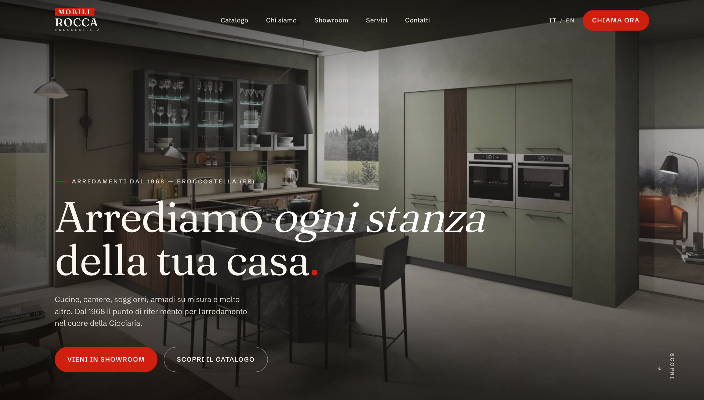
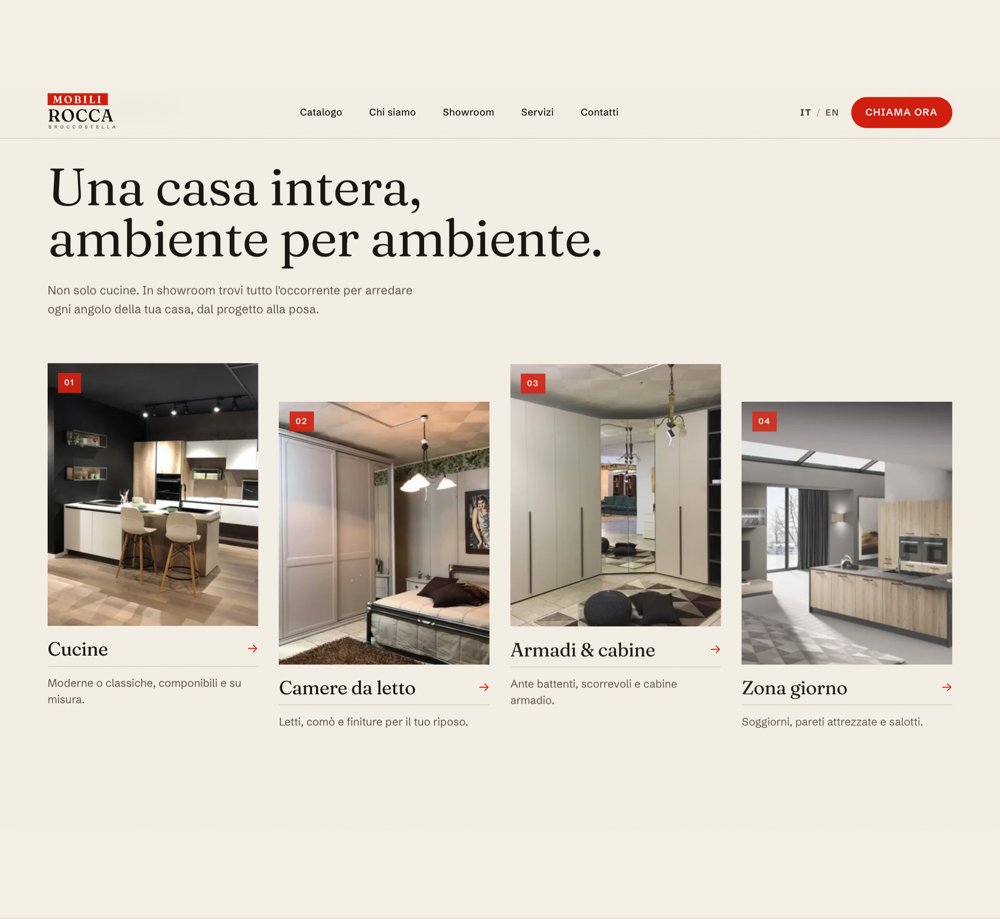
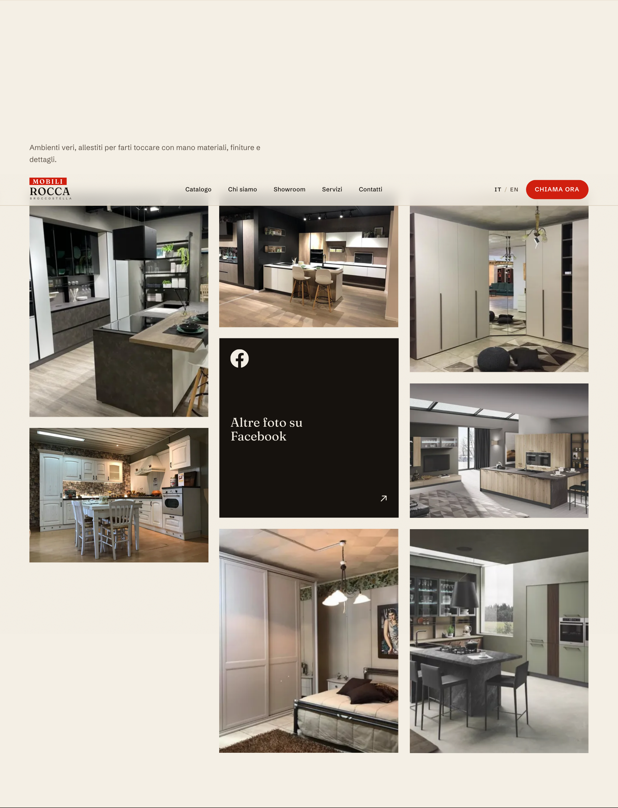
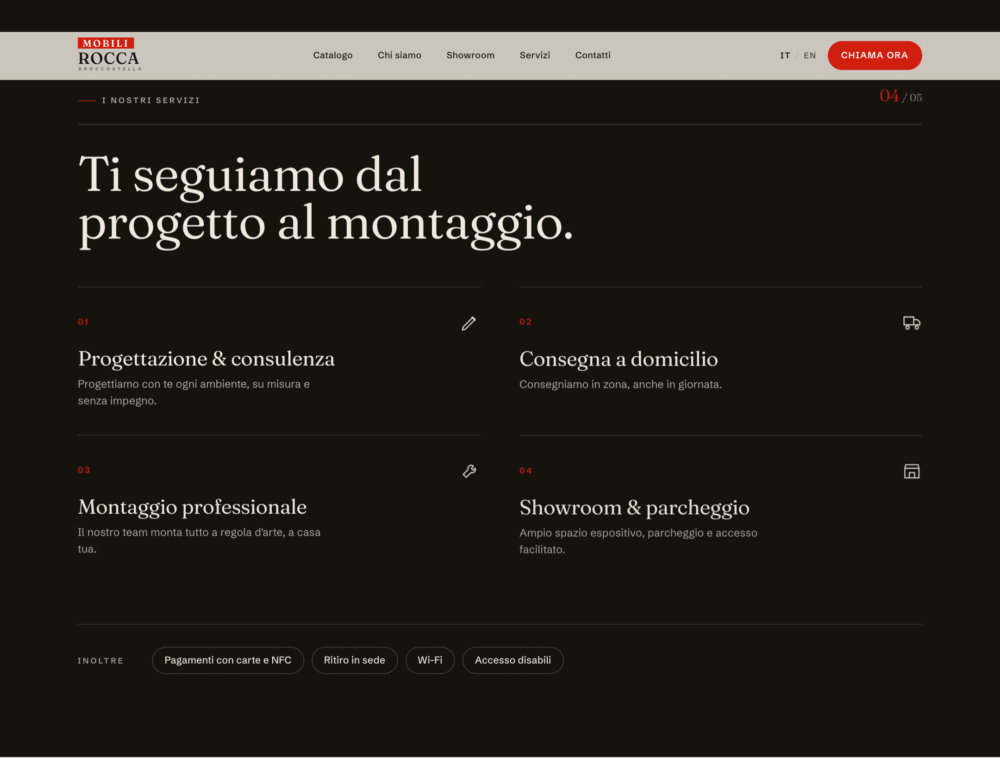
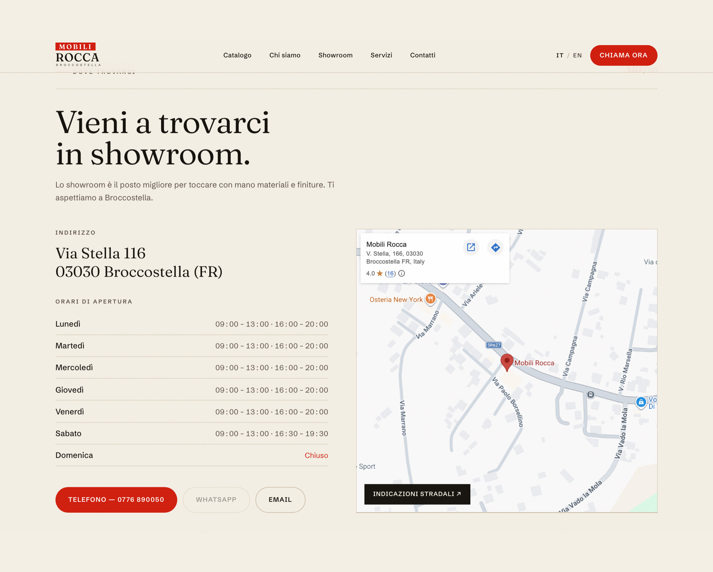
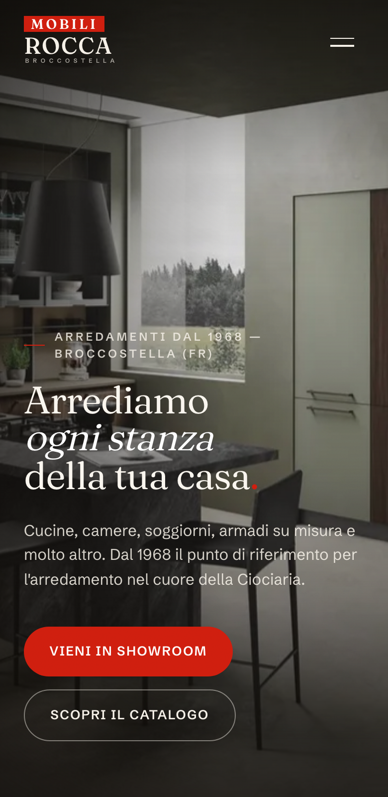

# Mobili Rocca — Landing Page

Bilingual (🇮🇹 / 🇬🇧) marketing landing page for **Mobili Rocca S.r.l.**, a family-run
furniture showroom in Broccostella (FR), Italy — furnishing the Ciociaria area since 1968.

Built with **Astro** + **Tailwind CSS v4**. Static output, image optimization at build time,
near-zero client JavaScript. Editorial design in the brand's red / black / cream identity.



---

## Screenshots

| Catalogo | Showroom |
| --- | --- |
|  |  |

| Servizi | Contatti |
| --- | --- |
|  |  |

<p align="center">
  
</p>

---

## Highlights

- **One scrolling page**, anchor navigation: Hero · Catalogo · Chi siamo · Showroom · Servizi · Contatti.
- **Two languages** — Italian at `/`, English at `/en/`, with an in-header toggle.
- **Editorial design** — cream paper, warm ink, brand red accents. Display type *Fraunces*,
  body *Schibsted Grotesk* (self-hosted, no external font requests).
- **Optimized images** — source photos are compressed to responsive WebP automatically by Astro.
- **Direct contact** — click-to-call, WhatsApp (auto-disabled until a number is set), email,
  and an embedded Google Map. No backend required.
- **Built to be edited** — text, colours, photos and business details each live in one
  clearly-labelled file (see [`EDITING.md`](EDITING.md)).

---

## Tech stack

| | |
| --- | --- |
| Framework | [Astro](https://astro.build) (static output) |
| Styling | [Tailwind CSS v4](https://tailwindcss.com) + CSS custom properties |
| Fonts | Fraunces + Schibsted Grotesk via `@fontsource-variable` (self-hosted) |
| Images | `astro:assets` (responsive WebP) |
| i18n | Astro built-in routing (`it` default, `en` prefixed) |

---

## Project structure

```
src/
├── assets/             showroom photos + logo (optimized at build)
├── components/         Home + section components (Header, Hero, Categories,
│                       About, Gallery, Services, Contact, Footer, Logo, SectionHead)
├── config/
│   ├── site.ts         business facts: address, phone, hours, map, partners
│   └── images.ts       single map of every photo used on the site
├── i18n/ui.ts          all copy — Italian + English dictionaries
├── layouts/Base.astro  <html> shell, head/SEO, fonts, global scripts
├── styles/global.css   design tokens (colours, fonts) + base styles
└── pages/
    ├── index.astro     Italian  →  /
    └── en/index.astro  English  →  /en/
```

---

## Getting started

```bash
npm install        # install dependencies
npm run dev        # local dev server → http://localhost:4321
npm run build      # build static site → ./dist/
npm run preview    # preview the production build
```

Deploy the generated `dist/` folder to any static host (Vercel, Netlify, GitHub Pages…).

---

## Editing the site

Everyday changes don't require coding — see [`EDITING.md`](EDITING.md). In short:

| To change… | Edit… |
| --- | --- |
| Text / wording | `src/i18n/ui.ts` (keep Italian + English in sync) |
| Contact details, hours, WhatsApp | `src/config/site.ts` |
| Photos | `src/config/images.ts` (or replace a file in `src/assets/` with the same name) |
| Colours / fonts | top of `src/styles/global.css` |

### ⚠️ Placeholder data — replace before launch

Invented values (search `PLACEHOLDER` in `src/config/site.ts`): founding year, WhatsApp
number (currently empty → button disabled), email, and VAT number. Address, phone, opening
hours and the Facebook link are real.

---

## AI-assisted development

This project includes [`CLAUDE.md`](CLAUDE.md) / [`AGENTS.md`](AGENTS.md) with conventions and
guardrails for AI coding agents. Read them before making automated changes.
